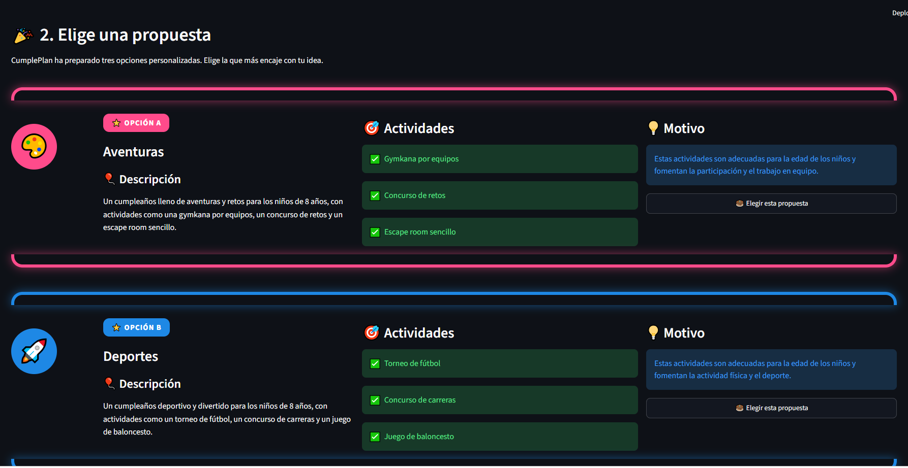
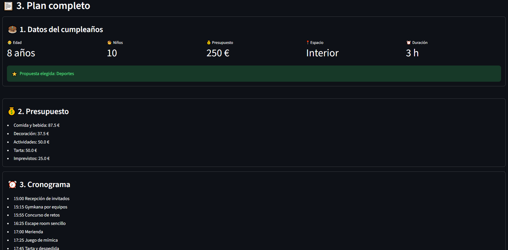
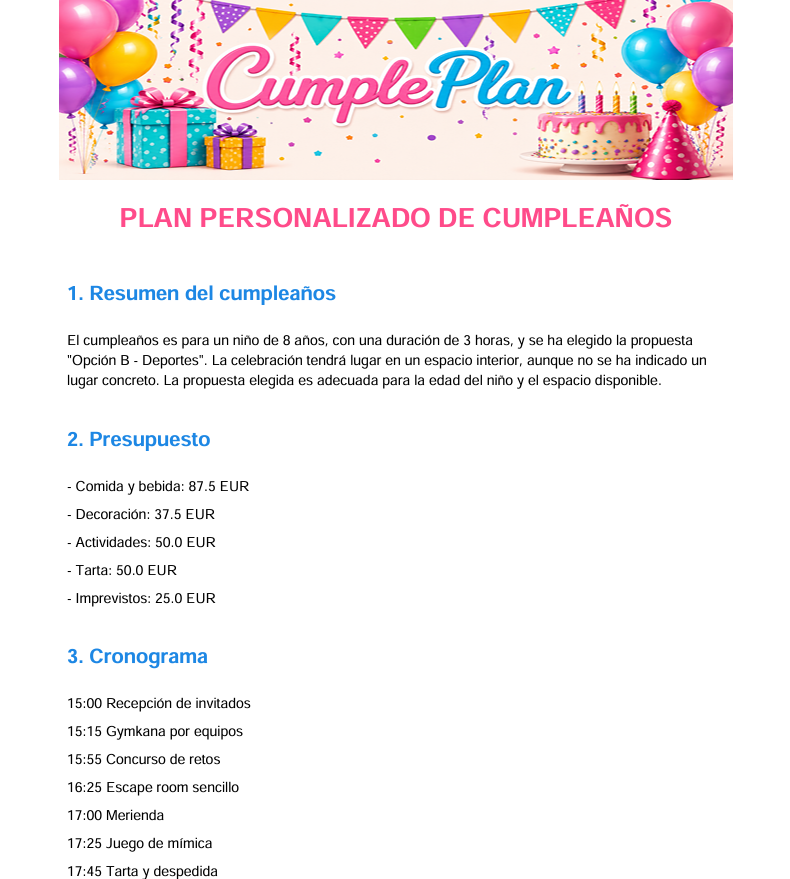
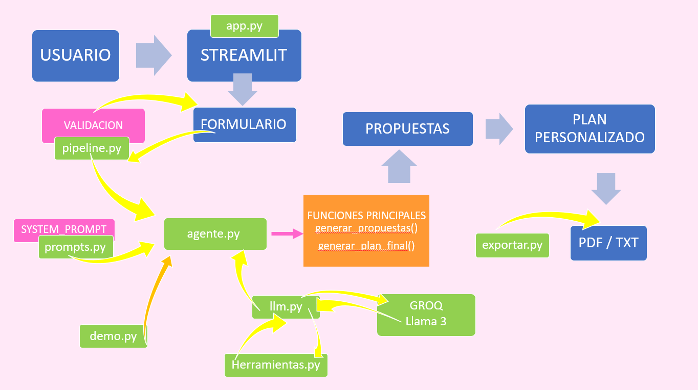

# 🎂 CumplePlan

<p align="center">
  
</p>

## 📖 Descripción

**CumplePlan** es un agente inteligente desarrollado con **Python**, **Streamlit** y **Groq (Llama 3)** que ayuda a planificar cumpleaños infantiles personalizados.

A partir de los datos proporcionados por el usuario, el agente genera diferentes propuestas adaptadas a las necesidades del evento y elabora un plan completo con presupuesto, cronograma, actividades, comida, lista de materiales y recomendaciones.

---

# ✨ Características principales

- 🤖 Generación automática de propuestas mediante IA.
- 🎂 Planificación personalizada según las características del evento.
- 💰 Presupuesto distribuido automáticamente.
- ⏰ Cronograma detallado.
- 🎈 Actividades adaptadas a la edad.
- 🍕 Recomendaciones de comida y bebida.
- 🛒 Lista de materiales.
- ⚠️ Advertencias y plan alternativo.
- 📄 Exportación del plan en PDF.
- 📝 Exportación del plan en TXT.
- 🎭 Modo Demo sin consumir tokens.

---

# 📸 Capturas

## Pantalla principal


---

## Selección de propuestas



---

## Plan personalizado



---

## Exportación en PDF



---

# 🏗 Arquitectura del proyecto



---

# 📂 Estructura del proyecto

```text
CumplePlan/

│
├── app.py
├── agente.py
├── llm.py
├── prompts.py
├── pipeline.py
├── herramientas.py
├── demo.py
├── exportar.py
├── README.md
├── images/
└── .env
```

---

# 📖 Descripción de los archivos

## 📱 app.py

Archivo principal de la aplicación desarrollado con Streamlit. Gestiona la interfaz gráfica, la navegación entre pasos, recoge los datos del usuario, muestra las propuestas generadas, presenta el plan final y permite su exportación en PDF o TXT.

---

## 🤖 agente.py

Orquestador del agente inteligente. Coordina todo el flujo de ejecución: recibe los datos del usuario, ejecuta el pipeline, decide si utilizar IA o modo Demo y genera tanto las propuestas como el plan personalizado.

---

## 🧠 llm.py

Gestiona la comunicación con Groq. Envía el System Prompt, el User Prompt y las herramientas disponibles al modelo LLM, además de gestionar las llamadas automáticas a herramientas (*tool calling*).

---

## ✍️ prompts.py

Contiene el System Prompt que define el comportamiento del agente, el formato de las respuestas y las instrucciones que debe seguir la IA para generar propuestas y planes personalizados.

---

## 🔍 pipeline.py

Procesa y valida la información introducida por el usuario antes de enviarla al agente, devolviendo los datos preparados junto con posibles errores o advertencias.


---

## 🛠 herramientas.py

Implementa las herramientas utilizadas por el agente para calcular presupuestos, generar cronogramas, recomendar actividades, sugerir comida y bebida y crear listas de materiales.

---

## 🎭 demo.py

Permite ejecutar la aplicación sin utilizar la IA. Genera propuestas y planes de ejemplo para facilitar el desarrollo y las pruebas sin consumir tokens.

---

## 📄 exportar.py

Genera los documentos finales del proyecto en formato PDF y TXT.

---

## 🔐 .env

Archivo que almacena la API Key de Groq y otra información sensible. No debe compartirse ni subirse al repositorio.


---

# 🔄 Flujo del agente

1. El usuario introduce los datos del cumpleaños mediante la interfaz desarrollada en Streamlit.
2. El pipeline valida toda la información recibida.
3. El agente prepara el contexto y construye el prompt.
4. `llm.py` envía la petición a Groq (Llama 3).
5. Si el modelo necesita información adicional, realiza llamadas a las herramientas disponibles.
6. Se generan tres propuestas personalizadas.
7. El usuario selecciona una de ellas.
8. El agente crea el plan completo.
9. El resultado se muestra en pantalla y puede exportarse en PDF o TXT.

---

# 🛠 Tecnologías utilizadas

- Python 3.12
- Streamlit
- Groq API
- Llama 3
- ReportLab
- python-dotenv


---

# 🚀 Posibles mejoras futuras

- Integración con una API meteorológica.
- Integración con Google Maps.
- Generación automática de listas de compra.
- Recomendación de proveedores cercanos.
- Envío automático del plan por correo electrónico.

---

# 👨‍💻 Autores


**Autor:**

- Ainara Villanueva

Año 2026

